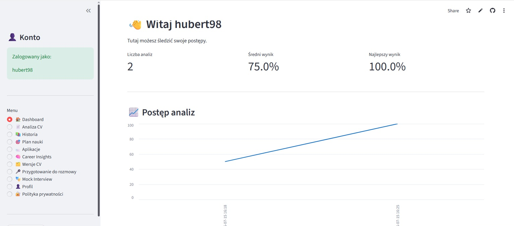
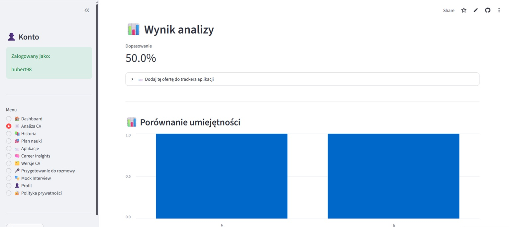
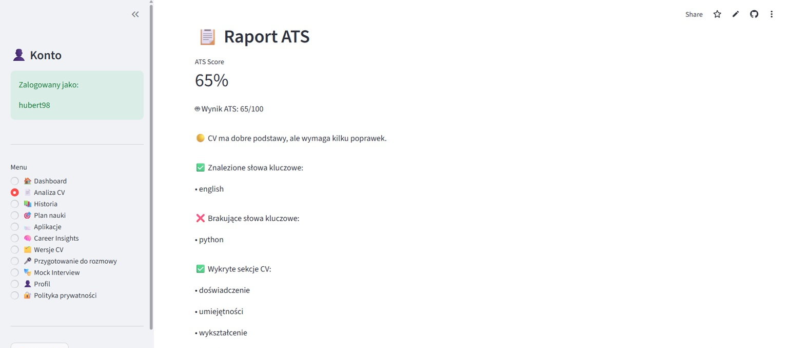
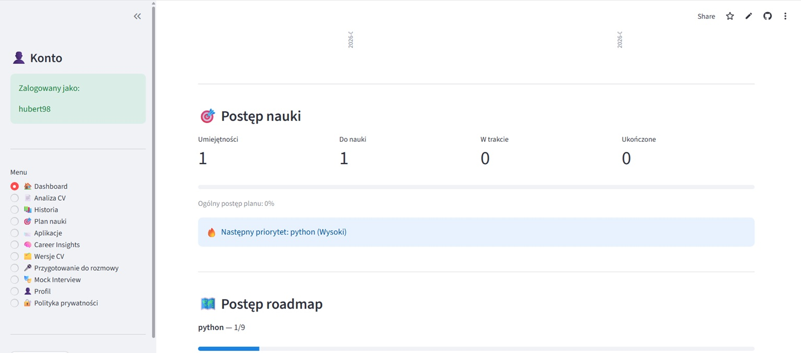
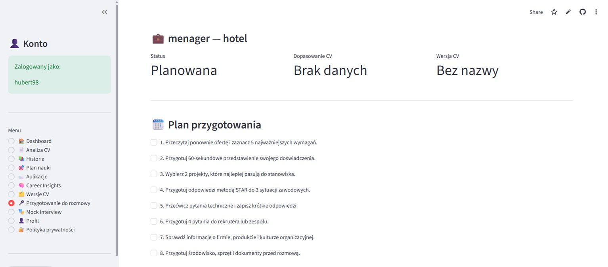
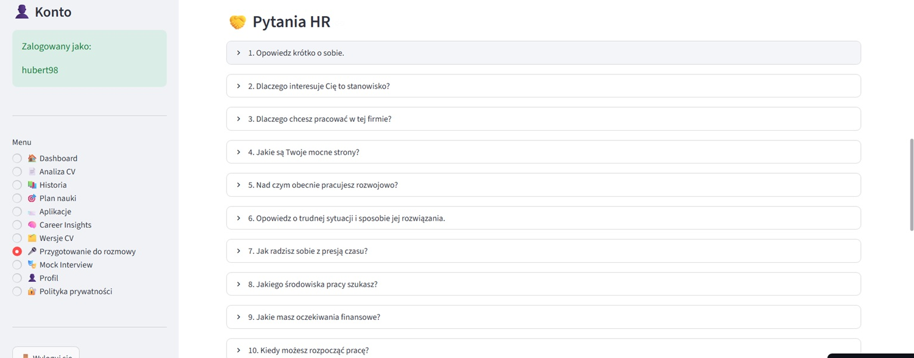

# AI Job Assistant

A deployed Streamlit application supporting CV analysis, application
tracking, learning planning, interview preparation, and career insights.

## Live Demo

**Application:**
https://ai-job-assistant-udluo7y9au7dbhbypynpzu.streamlit.app

**Source code:** https://github.com/sharingmyworld/ai-job-assistant

AI Job Assistant is a Streamlit web application that supports the
job-search process: CV analysis, application tracking, learning
planning, interview preparation, and career insights.

## Screenshots

### Dashboard and progress tracking



### CV analysis



### ATS report



### Learning progress



### Interview preparation



### HR interview questions



## Features

-   User registration and secure login with bcrypt password hashing
-   Optional persistent login with encrypted cookies
-   CV and job-offer analysis
-   ATS-oriented report generation
-   Analysis history and CV version tracking
-   Automatic learning plan based on missing skills
-   Skill roadmaps and weekly learning goals
-   Job application tracker with statuses, notes, events, and follow-up
    support
-   Career Insights dashboard
-   Interview preparation and feedback tracking
-   Mock Interview with answer scoring and feedback
-   User data export to JSON
-   Password change
-   Secure account and user-data deletion
-   Privacy policy and registration acknowledgement
-   PostgreSQL connection pooling, retry handling, and Streamlit caching
-   Automated tests for core application logic

## Tech Stack

-   Python
-   Streamlit
-   PostgreSQL
-   Supabase
-   psycopg2
-   pandas
-   Altair
-   bcrypt
-   ReportLab
-   python-dotenv
-   pytest
-   Git and GitHub
-   Streamlit Community Cloud

## Project Structure

``` text
ai-job-assistant/
├── app.py
├── auth.py
├── database.py
├── db/
│   ├── connection.py
│   ├── analyses.py
│   ├── learning.py
│   ├── applications.py
│   ├── interviews.py
│   ├── auth_tokens.py
│   ├── insights.py
│   ├── export_data.py
│   └── account.py
├── views/
│   ├── dashboard.py
│   ├── analysis.py
│   ├── history.py
│   ├── learning_plan.py
│   ├── applications.py
│   ├── career_insights.py
│   ├── cv_versions.py
│   ├── interview_prep.py
│   ├── mock_interview.py
│   ├── profile.py
│   └── privacy.py
├── tests/
│   └── test_core_logic.py
├── requirements.txt
├── requirements-dev.txt
└── .env.example
```

## Local Setup

### 1. Clone the repository

``` bash
git clone https://github.com/sharingmyworld/ai-job-assistant.git
cd ai-job-assistant
```

### 2. Install dependencies

``` bash
python -m pip install -r requirements.txt
python -m pip install -r requirements-dev.txt
```

### 3. Configure environment variables

Create a `.env` file in the project root. Use `.env.example` as a
reference.

``` env
AI_JOB_COOKIE_PASSWORD="your-long-random-secret"
DATABASE_URL="your-postgresql-connection-string"
PRIVACY_OPERATOR_NAME="Your name or operator name"
PRIVACY_CONTACT_EMAIL="your-contact-email"
```

Never commit `.env` or database credentials to the repository.

### 4. Run the application

``` bash
python -m streamlit run app.py
```

## Tests

Run the automated core-logic tests with:

``` bash
python -m pytest
```

The current test suite covers answer evaluation, job-title detection,
follow-up rules, follow-up message generation, and learning roadmaps.

## Database

The application uses PostgreSQL. The database layer is split into
domain-focused modules under `db/`.

`database.py` remains a compatibility facade for existing imports.

The connection layer uses a threaded connection pool, connection retry
handling, and a user-friendly database-unavailable state.

## Security and Privacy

-   Passwords are hashed with bcrypt.
-   Database credentials and cookie secrets are stored in environment
    variables.
-   Persistent-login tokens can be revoked.
-   Users can export their application data to JSON.
-   Users can permanently delete their account and associated data.
-   The application includes a privacy-policy view and acknowledgement
    during registration.

## Deployment

The application is designed for deployment on Streamlit Community Cloud
with PostgreSQL hosted on Supabase.

Required deployment secrets:

``` toml
AI_JOB_COOKIE_PASSWORD = "your-long-random-secret"
DATABASE_URL = "your-postgresql-connection-string"
PRIVACY_OPERATOR_NAME = "Your name or operator name"
PRIVACY_CONTACT_EMAIL = "your-contact-email"
```

## Technical Decisions

-   Modular database layer split into domain-focused modules.
-   Compatibility facade in `database.py` to preserve existing imports
    during refactoring.
-   PostgreSQL connection pooling and retry handling.
-   User-friendly database outage state instead of exposing raw errors.
-   User-controlled data lifecycle through JSON export and permanent
    account deletion.
-   Core application logic tested independently from the Streamlit UI.

## What I Learned

Building AI Job Assistant involved moving from a local Python prototype
to a deployed web application with persistent PostgreSQL storage.

During the project I practiced:

-   structuring a Python application into smaller modules,
-   integrating Streamlit with PostgreSQL and Supabase,
-   deploying an application with environment-based secrets,
-   using Git and GitHub in an iterative development workflow,
-   refactoring a large database module,
-   handling database connection failures and application state,
-   implementing authentication and persistent sessions,
-   adding data export and secure account deletion,
-   writing automated tests with pytest,
-   thinking about privacy and the user-data lifecycle.

## Project Status

The main MVP is complete and deployed. The project includes persistent
PostgreSQL storage, authentication, CV analysis, job-search management,
learning and interview tools, data export and deletion, privacy
information, database error handling, caching, and automated core-logic
tests.

## License

No license has been selected yet.
