<div align="center">

# 🤖 AI Job Assistant

### AI-powered support for CV analysis, ATS optimization, interview preparation, learning plans, and job application tracking.

[](https://www.python.org/)
[](https://streamlit.io/)
[](https://www.postgresql.org/)
[](https://supabase.com/)
[](https://pytest.org/)
[](https://ai-job-assistant-udluo7y9au7dbhbypynpzu.streamlit.app)

[Live Demo](https://ai-job-assistant-udluo7y9au7dbhbypynpzu.streamlit.app) ·
[Source Code](https://github.com/sharingmyworld/ai-job-assistant)

</div>

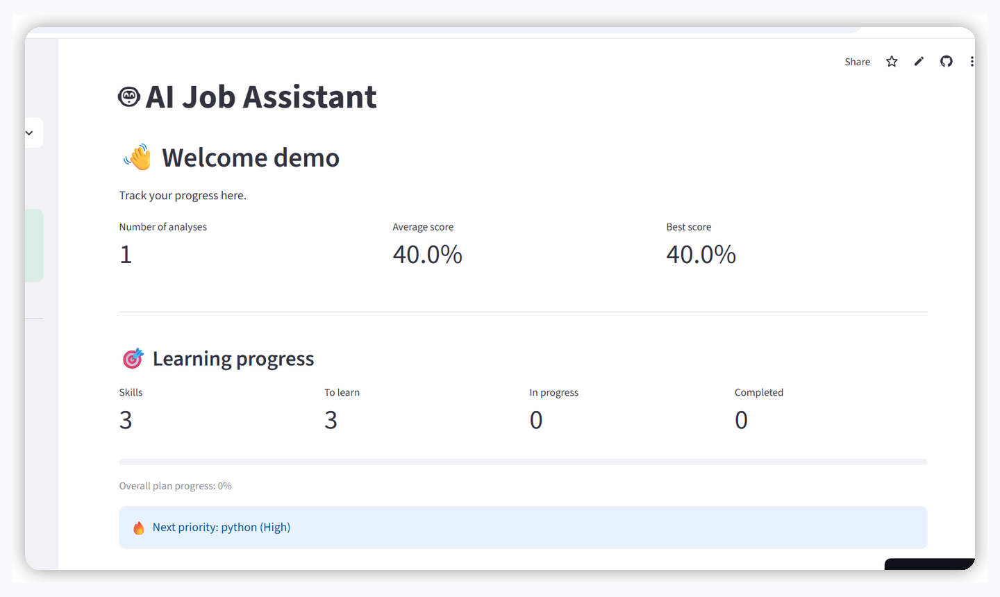

## Overview

AI Job Assistant is a deployed Streamlit application designed to support the full job-search workflow. It helps users compare a CV with a job posting, review ATS-oriented feedback, track applications, build personalized learning roadmaps, prepare for interviews, and monitor career progress.

The application supports both English and Polish interfaces and stores user data in PostgreSQL.

## Highlights

| Feature | What it does |
|---|---|
| 📄 CV Analysis | Compares a PDF CV with a job posting and calculates a match score |
| 📋 ATS Report | Reviews keyword coverage, CV sections, and ATS readiness |
| 🎯 Learning Plan | Turns missing skills into structured roadmaps and progress tracking |
| 💼 Application Tracker | Stores companies, roles, statuses, dates, notes, and follow-ups |
| 🎤 Mock Interview | Runs question-by-question interview sessions with saved answers |
| 🧠 Interview Preparation | Provides technical, HR, and company-focused interview questions |
| 📈 Career Insights | Summarizes analyses, recurring skill gaps, applications, and progress |
| 📂 CV Versions | Compares CV versions and their average matching performance |
| 🌍 Multilingual UI | Supports English and Polish |
| 🔐 Authentication | Uses bcrypt password hashing and optional persistent sessions |
| 📦 Data Controls | Supports JSON data export and permanent account deletion |

## Product Tour

### Dashboard

Track CV-analysis results, learning priorities, roadmap progress, and completed goals.


### CV Analysis

Paste a job posting, upload a CV, detect the job title, and save a named CV version.

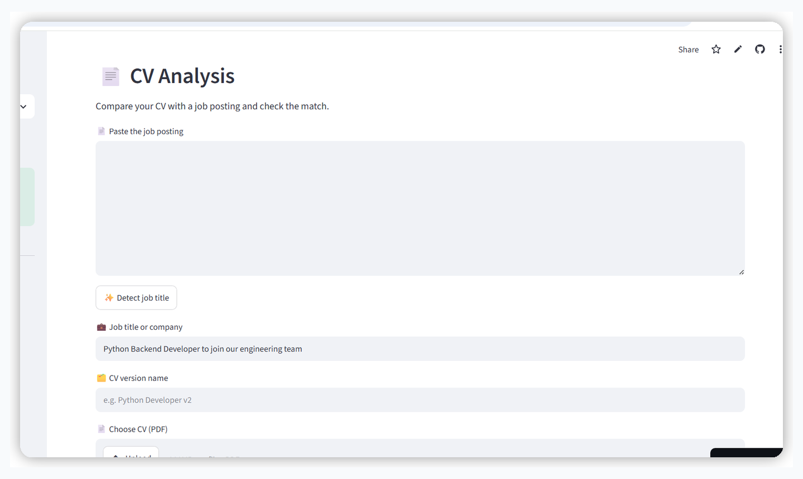

### Analysis Result

Review the match score, add the posting to the application tracker, and compare matched and missing skills.

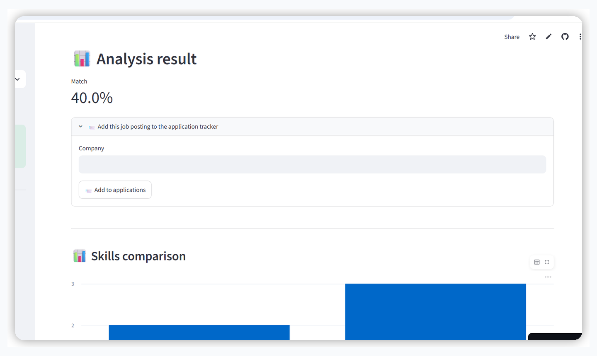

### ATS Report

Inspect ATS compatibility, keyword coverage, detected CV sections, and improvement suggestions.

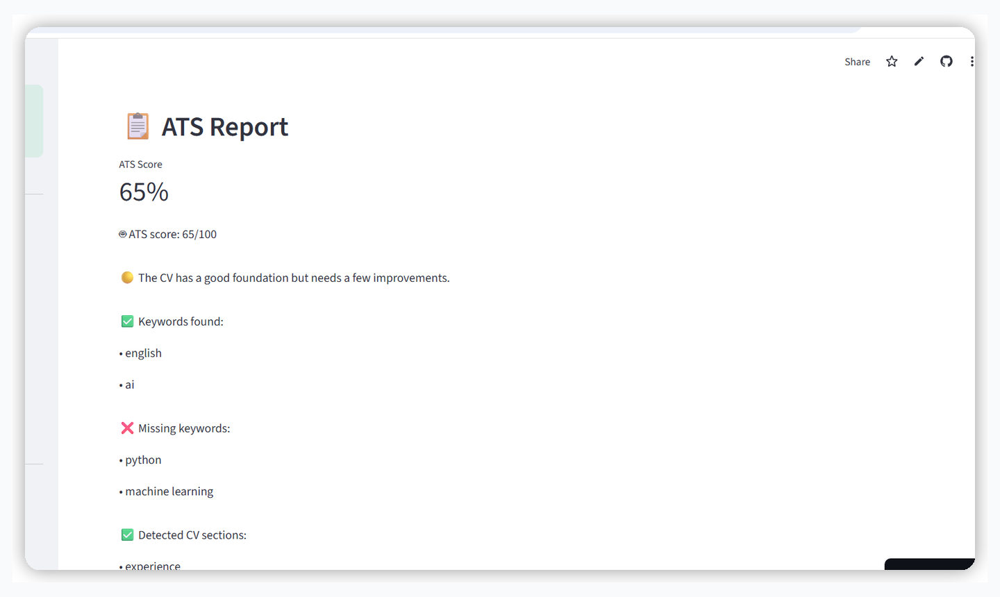

### Career Insights

See summary metrics, common skill gaps, application effectiveness, interview insights, and recommended next steps.

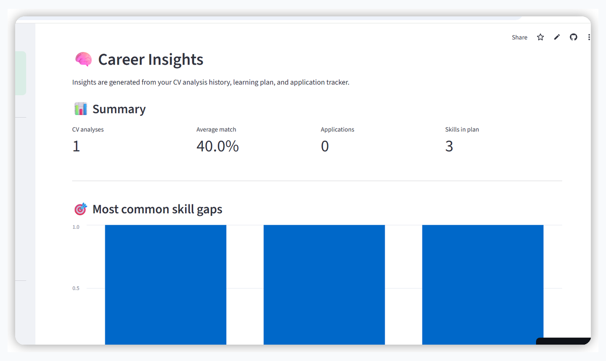

### Mock Interview

Practice one question at a time. Session progress and answers are stored in the database.

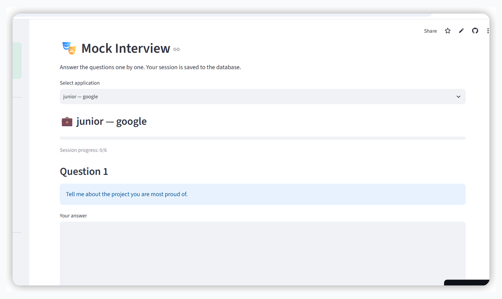

### Interview Preparation

Browse technical and HR questions before an interview.

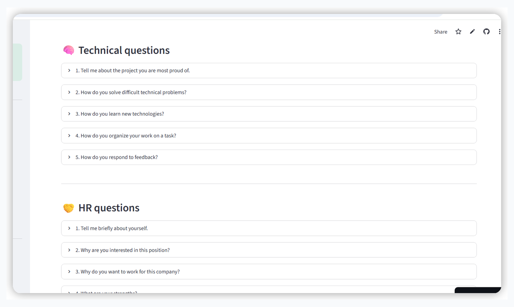

## Polish Interface

The application also includes a Polish-language interface.

<table>
<tr>
<td width="50%">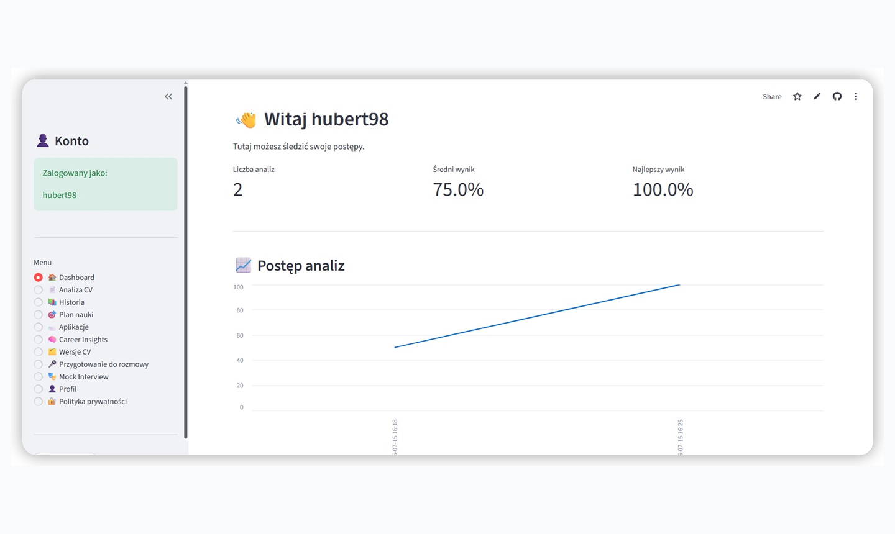</td>
<td width="50%">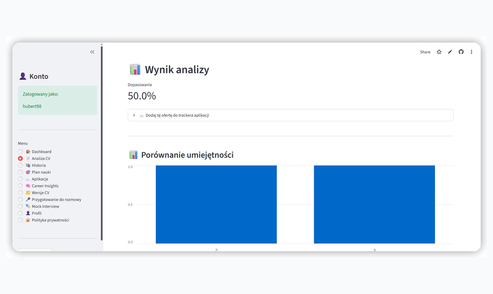</td>
</tr>
<tr>
<td width="50%">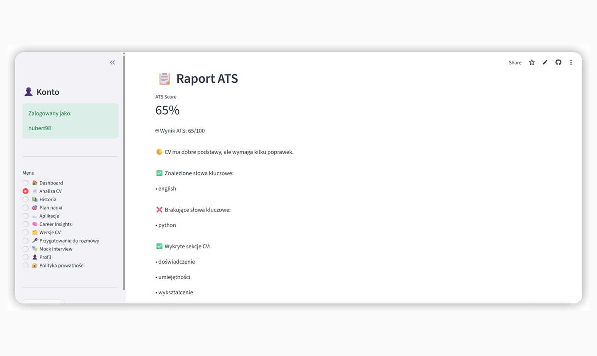</td>
<td width="50%">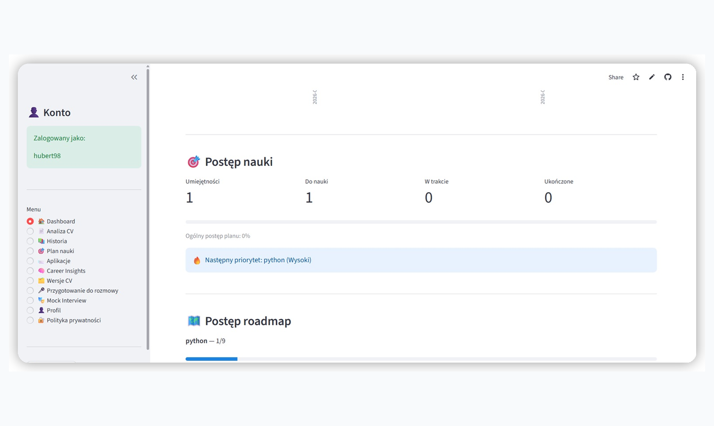</td>
</tr>
<tr>
<td width="50%">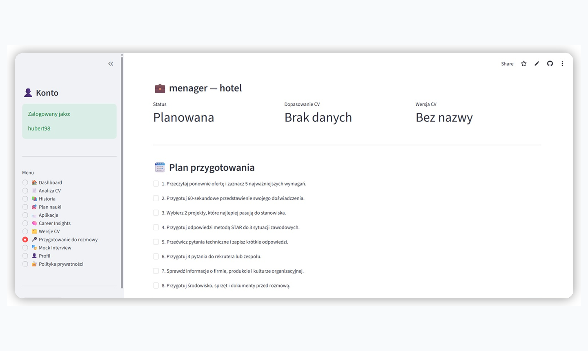</td>
<td width="50%">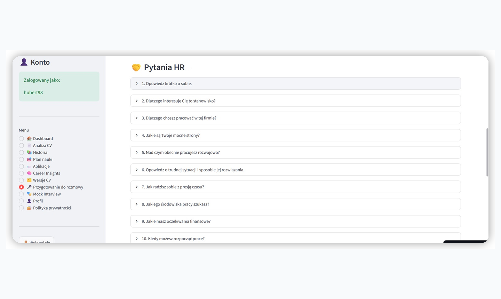</td>
</tr>
</table>

## Tech Stack

| Area | Technologies |
|---|---|
| Frontend / UI | Streamlit |
| Language | Python |
| Database | PostgreSQL |
| Hosted database | Supabase |
| Database driver | psycopg2 |
| Data processing | pandas |
| Charts | Altair |
| Authentication | bcrypt |
| PDF generation | ReportLab |
| Configuration | python-dotenv |
| Tests | pytest |
| Deployment | Streamlit Community Cloud |
| Version control | Git and GitHub |

## Architecture

```text
Streamlit UI
     │
     ▼
Views layer
     │
     ▼
Business logic and analysis modules
     │
     ▼
Domain-focused database modules
     │
     ▼
PostgreSQL / Supabase
```

## Project Structure

```text
ai-job-assistant/
├── app.py
├── auth.py
├── database.py
├── i18n.py
├── db/
│   ├── connection.py
│   ├── analyses.py
│   ├── learning.py
│   ├── applications.py
│   ├── interviews.py
│   ├── auth_tokens.py
│   ├── insights.py
│   ├── export_data.py
│   └── account.py
├── views/
│   ├── dashboard.py
│   ├── analysis.py
│   ├── history.py
│   ├── learning_plan.py
│   ├── applications.py
│   ├── career_insights.py
│   ├── cv_versions.py
│   ├── interview_prep.py
│   ├── mock_interview.py
│   ├── profile.py
│   └── privacy.py
├── tests/
│   └── test_core_logic.py
├── assets/
│   └── screenshots/
│       ├── en/
│       └── pl/
├── requirements.txt
├── requirements-dev.txt
└── .env.example
```

## Local Setup

### 1. Clone the repository

```bash
git clone https://github.com/sharingmyworld/ai-job-assistant.git
cd ai-job-assistant
```

### 2. Install dependencies

```bash
python -m pip install -r requirements.txt
python -m pip install -r requirements-dev.txt
```

### 3. Configure environment variables

Create a `.env` file in the project root and use `.env.example` as a reference.

```env
AI_JOB_COOKIE_PASSWORD="your-long-random-secret"
DATABASE_URL="your-postgresql-connection-string"
PRIVACY_OPERATOR_NAME="Your name or operator name"
PRIVACY_CONTACT_EMAIL="your-contact-email"
```

Never commit `.env`, database credentials, or private keys.

### 4. Run the application

```bash
python -m streamlit run app.py
```

## Tests

Run the automated tests with:

```bash
python -m pytest
```

The test suite covers core application logic such as answer evaluation, job-title detection, follow-up rules, follow-up message generation, and learning roadmaps.

## Database

The application uses PostgreSQL. The database layer is divided into domain-focused modules under `db/`.

`database.py` remains a compatibility facade for existing imports. The connection layer uses a threaded connection pool, retry handling, and a user-friendly database-unavailable state.

## Security and Privacy

- Passwords are hashed with bcrypt.
- Database credentials and cookie secrets are stored in environment variables.
- Persistent-login tokens can be revoked.
- Users can export their data to JSON.
- Users can permanently delete their account and associated records.
- Registration includes privacy-policy acknowledgement.
- Raw database errors are not exposed directly to users.

## Deployment

The project is designed for Streamlit Community Cloud with PostgreSQL hosted on Supabase.

Required deployment secrets:

```toml
AI_JOB_COOKIE_PASSWORD = "your-long-random-secret"
DATABASE_URL = "your-postgresql-connection-string"
PRIVACY_OPERATOR_NAME = "Your name or operator name"
PRIVACY_CONTACT_EMAIL = "your-contact-email"
```

## Technical Decisions

- Modular database layer split into domain-focused modules.
- Compatibility facade retained during refactoring.
- PostgreSQL connection pooling and retry handling.
- User-friendly database outage handling.
- User-controlled data lifecycle through export and permanent deletion.
- Core logic tested independently from the Streamlit UI.
- Translation strings separated into an `i18n.py` module.

## What I Learned

Building AI Job Assistant involved moving from a local Python prototype to a deployed web application with persistent PostgreSQL storage.

The project provided practical experience in:

- structuring a Python application into smaller modules,
- integrating Streamlit with PostgreSQL and Supabase,
- deploying with environment-based secrets,
- using Git and GitHub in an iterative workflow,
- refactoring a large database module,
- handling connection failures and application state,
- implementing authentication and persistent sessions,
- adding data export and secure account deletion,
- writing automated tests with pytest,
- designing a multilingual interface,
- thinking about privacy and the user-data lifecycle.

## Project Status

The main MVP is complete and deployed. The application includes authentication, persistent storage, CV analysis, ATS reports, learning and interview tools, job-search management, data export, account deletion, privacy information, database error handling, caching, and automated core-logic tests.

## Possible Next Steps

- Add OAuth authentication
- Add Docker support
- Expand automated test coverage
- Add CI/CD with GitHub Actions
- Improve mobile responsiveness
- Add email reminders for follow-ups
- Add richer PDF export options

## License

No license has been selected yet.
